# Introduction

In this paper, my VR opera *Artemis* is examined in detail via
discussions of effective VR techniques and implementation. I consider
how autoethnography can be deployed for successful prototyping, and how
the design and implementation underpinning the creative development
process for virtual environments have been utilised to stage my new
extended reality opera *Artemis.* Making a VR opera entails the creator
being multidisciplinary. Creating the virtual environment (henceforth
VE) for *Artemis* brings together game design, architecture, game
aesthetics, broad-brush prototyping, and precision to detail in creating
comfortable and safe VR experiences for users.

*Unity3D*, a platform for 3D world creation, is utilised to create an
Oculus VR version of the opera work for the *Oculus Quest*. *Unity
Technologies* promote their product by describing how virtual reality
heightens a creator's creativity in relating a narrative. They state
that the creative opportunities are endless when a creator realises
their imagination with the *Unity3D* canvas (Unity Technologies, 2020).
The creator designs a world, which enhances the word-painting of each
piece. This combination of word painting and world-building immerses the
creator and audience member both sonically and visually. Peters et al.
(2016) argue that *Unity3D* was the most adaptable and robust software
to create VR and AR applications when their study was undertaken, which
seems to correlate to present-day industry usage.

This paper will discuss the techniques that were used to increase the
effectiveness of the extended reality opera prototyping, including 3D
spatial sound as a cheap UI aid for graphics trade-off (Brenda Laurel,
Atari research, 1980s). I am employing 3D spatial sound in my Oculus
prototype development, by using the *FMOD* '3D object Spatializer'
plugin on each audio event.

<!-- VR painting software for AR content creation and VR asset creation -->

I have experimented with painting the virtual environment models for the
Oculus VR experience in *Tilt Brush* and importing my *Tilt Brush*
painting into *Unity3D* with Poly, editing the virtual world in
*Unity3D* and distributing it on the *Oculus Quest* to be experienced
with the *Oculus* Link throughout all prototyping. The learnings that I
am presenting in this paper include self-experiential prototyping
methodologies and models, as well as the creative processes employed as
a composer-designer. These learnings may be useful for
composer-designers who are looking to create their own extended reality
productions.

# Methods

I drew together the theories proposed by Schell (2020) to create my
models for self-experiential prototyping (see figure 5 and figure 6). I
also drew upon risk mitigation for game development methodologies; the
idea behind risk mitigation is that the creator tries to reduce and
eliminate risks to game enjoyment, to improve the game mechanics and
effectiveness of the overall game experience. In the next section I will
describe how this is achieved by building lots of fast and dirty small
prototypes (Schell, 2020), this technique was implemented throughout
2020 and 2021 to create the first iterations of the opera *Artemis*.

<!-- Prototype creation -->

For each prototype iteration, I strived to find any barriers to the
enjoyment of the VR experience, such as inaccurate head tracking in the
Oculus VR experience and spawning in the incorrect position in the Unity
build. I then eliminated these risks in the following prototype build.
To prototype my VR opera, I employed risk mitigation and prototyping
workflows.

I prototyped various different Greek-inspired virtual environments in
*Unity3D* and the visuals inspired the music and vice versa. This fits
into the light and sound architect Xenakis' creative process of being
inspired by music and mathematical formula visualisations to create
architectural structures (Xenakis, 1992). I am inspired by visuals to
create the music. I fuse virtual visual and sonic elements to create an
opera set in Ancient Greece. Xenakis created a light bulb and laser work
in _Formalized Music_ by employing the relationship between light and
sound successfully, as each light bulb is a different frequency and
pitch in the musical composition. In prototyping *Artemis*, the distance
proximity of the spatialised audio in the Oculus VR version employs the
relationship between light (visuals) and sound.

## The lens of immersive opera

Composing for a medium such as virtual reality and augmented reality
entails creating media-based immersion by creating set designs similar
to film sets or immersive theatre. In future exhibitions of the Oculus
version the additional staging elements are dry leaves collected and
placed in the space, tactile sensory elements are incorporated to
immerse the audience in the experience. Dry leaves are placed on a
plinth and add the tactile and sonic aspects of holding autumn leaves
whilst listening to the 'Autumn Ayre Aria'.

Whilst participants are in the spring environment listening to 'Licht
und Liebe', sprayed rose water adds the sensory smell of roses. In the
summer virtual reality environment for 'Mi amor la luna', a fan
blowing warm air is placed in front of participants to create the
immersive experience of being in a hot summer environment. In 'Winter
Duet' particles of paper confetti are dropped onto the participant to
create the tactile experience of falling snow. As the offboarding
activity the audience member may take home any of these objects
alongside their paper cut out onboarding object.

## The lens of composer as researcher: themes in world creation, themes in music

I composed the arias and duets using *Finale*; the scores were rehearsed
and performed by the three performers, the work recorded in The Nickson
Room. I then edited the recordings in *Ableton Live*, exported the audio
files and imported the audio into *Unity3D* and *FMOD,* I split the
recording of the entire opera into 4 parts and mapped each composition
to a different vase for the Oculus version, essentially mapping audio to
objects as sound sources.

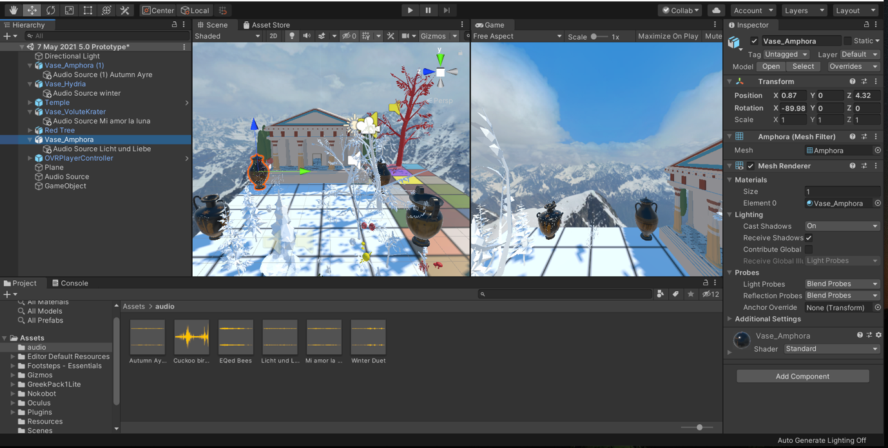{ width=50% }

{ width=50% }

{ width=50% }

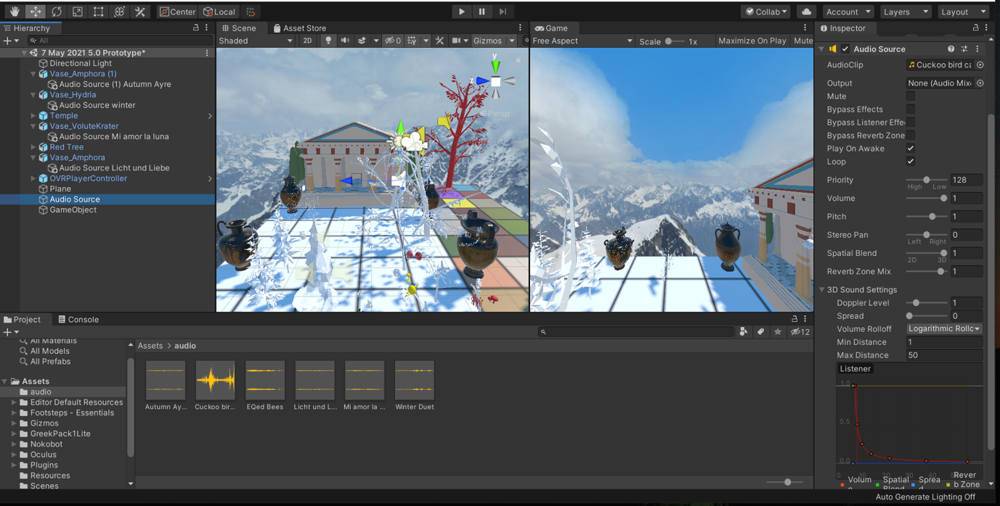{ width=50% }

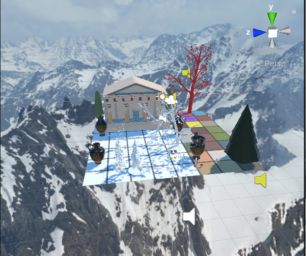{ width=50% }

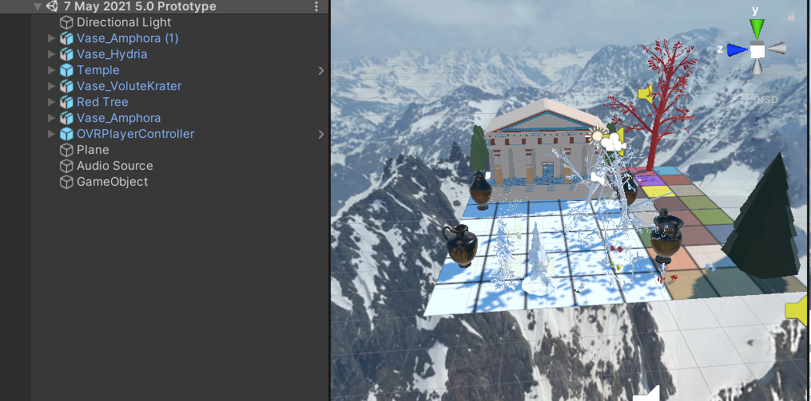{ width=50% }

I wrote each corresponding piece during this process, drawing upon the
visual aspects and utilising word-painting, highlighting the different
environmental factors of each season.
The works reflected the following rationale, scale and scope:

- **Rationale:** Seasons reflect nature, and the environment is a medium; this theme is realised visually and sonically in the compositional sonic and virtual worlds created.
- **Scale:** idea transferred across mediums.
- **Scope:** Performance design is vital with technologies. Virtual reality is a core component of the story. Virtual reality is a playful element.

*Artemis* comprises arias and duets utilising original German, English
and Spanish libretto, with the mezzo-soprano as the central character.

In conclusion, *Artemis* is in the XR art experience category, the
definitions of XR art and games are split in Screen Australia, thus I am
drawing inspiration from video games, and XR art experiences are
leveraged for *Artemis*.

<!-- {width="3.216418416447944in"
height="2.689283683289589in"} -->

The Oculus version of *Artemis* entails users roaming a plane containing
a Greek temple and four vases (see Figure 6).
Within the context of a non-linear opera, objects are interactable, and
when the audience member touches an object, a fragment of the music is
heard, the user controls how it is played back. The user is a live sound
mixer, the user manipulation is simply proximity-based interactivity,
the user changes which aria or duet is played back according to their
proximity to the four vases. The high-level environmental sounds were
mapped to the trees in the experience and the proximity of the user
triggers the playback of the environmental bird call sounds. This is
similar to the way that the spatial sound sources are mapped to each
vase. Essentially the vase interactions and environmental sounds are all
triggered by the user's proximity to certain visual assets.

Creating and making assets and models of the visual experience in *Tilt
Brush* gives deeper meaning to the creative process by creating in VR
for VR. I am bringing in my perspective from the get-go by prototyping
in VR in real-time, then importing my models into *Unity3D* and
deploying the built virtual environment to the VR headset, which results
in a cyclical artistic practice process in action formula for creating
new Oculus VR music works.

Social presence is enhanced with virtual hands, which map to the users
real hands; this is called hand presence. Virtual black hands have been
created for hand tracking. 3D sound, spatial imagery and immersive 3D
sound create an intimate sense of being there and aid in navigating
spatially (Spillers, 2017).
VR development is examined in detail via discussions of effective VR
techniques and implementation.

# Results 

The outcomes and learnings from my research include the development of
new models and processes. My autoethnographic prototyping method employs
iterative models which I created (figure 5 and figure 6). Figure 10
explains the steps needed for self-experiential prototyping to create
new VR opera experiences.

Figure 6 helps structure the creators iterative VR prototyping process,
as they systematically utilise the steps to create VR opera. By writing
down the problem statement before building the VE in *Unity3D*, the
creator has a methodology for designing a VR opera experience; solo
testing in the VR headset follows on linearly. Utilising problem
statements in an iterative loop is drawn from game design methodology.
The testing of these problem statements forms a methodical way for
creating a VR opera in a planned manner, the following six steps entail
how you go about using problem statements in an iterative loop. The
first step in action based, it is the act of doing, the second step is
making, it entails building and refining your virtual environment in the
*Unity3D* game engine. Step three entails you solo testing your
experience, by putting on your VR Oculus headset and walking around in
the virtual world which you have created. You then take the VR Oculus
headset off and move to step 4, the act of reflection which entails
thinking about and writing down what you believe could be fixed to make
the experience of being in the virtual world better. This entails
writing down a problem statement and testing again. The final step is
asking for advice and feedback on your experience by consulting an
expert.

Receiving expert advice entails receiving improvement suggestions and
advice; this may be advice regarding spatial sound, asset use,
interaction possibilities, tips on building functions to increase
enjoyment through audio middleware and C# scripts.

I used *Tilt Brush* painting software, in which the artist is immersed
in a 3D environment whilst painting. I created in the 360-degree medium
and filmed and exported my work from this 3D environment. *Tilt Brush*
allowed me to paint assets from scratch, which was an entirely iterative
process, as I employed quick and dirty prototyping through
experimentation, trial and error. I approached the autoethnographic
journal by writing down problem statements (Schell, 2020). Fixing these
problems via self-experiential prototyping means that whilst I was in
the *Unity3D* build, I would walk around and move my head to see if it
was an enjoyable experience for the user.

Additionally, I documented the steps for creating materials and wrote
down issues that needed fixing in the next iteration of the prototype.
The journaling methodology I employed was based on Schell's (2020)
methodologies. It was a free form journal without question prompts,
rather I used headings of the six steps of the iterative loop. The
relationship to the design processes helped me keep track of any changes
that needed to be made to make better iterations.

Reflections upon lessons were journaled systematically. For example, one
journal entry described the learnings for prototyping "learnt from
Michelle Brown that the most stable *Unity3D* version for VR development
is 2019.4.20f1".

The steps employed to create successful builds were journaled, the
entries included the elements used in each prototype. For example,
learning which *Unity3D* software workflow works best for prototyping:
"including one of the *Artemis* rehearsal mp3 files. Firstly building
the models and text in *Tilt Brush*, then importing these fbx model
files into *Unity*3D utilising tilt-poly-toolkit-v1.0.4.unitypackage
Releases · mwellck/tilt-poly-toolkit-unity (github.com).This prototype
is a stationary experience with one audio source playing as the
soundtrack, a starry skybox complements the *Tilt Brush* models".

The aspects to be created and implemented in the following prototyping
session were subsequently journaled. For example, one journal entry
described what the next steps would be in my iterative loop prototyping
"Next up will be creating head tracking in the experience and mapping
different audio segments to different objects in the *Unity3D*
project".

## Journal entries

### VR Test 15 April

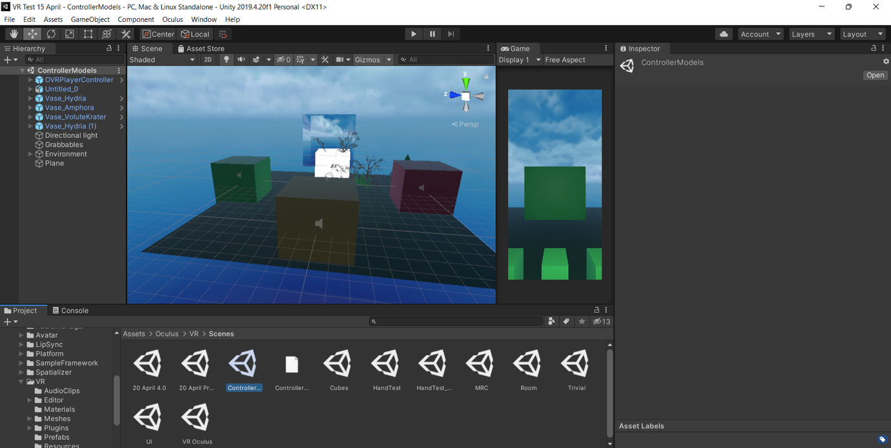{ width=80% }

#### Idea generation

I added audio sources to the game object cubes in Unity to correspond to
high-level sounds from each season:

1. Winter is a white cube; the audio source is 'Waves_Wind.'
2. Spring is a green cube; the audio source is 'cuckoo_bird_call.'
3. Summer is a yellow cube; the audio source is 'EQed Bees and Cicadas (Summer)'.
4. Autumn is a red cube; the audio source is 'SFX leaves falling for Autumn of Artemis'.

I utilised spatial blend: 3D, logarithmic, maximum Distance: 50.

#### Initial development

Problem statement 1: Can the user pick up the cubes and hear the
corresponding audio file?

#### Reflection and refinement

The build was successful; however, the 'ControllerModels' VR scene
sees you inside a 3D cube/room, which was quite claustrophobic and
different from expected. I made the top cube with wooden material in
*Unity3D*; for the second test, I am testing it again with the top cube
(which is essentially the ceiling) as an open skybox material so that
the user in the VR experience does not feel so boxed in.

#### Finalisation

This test is much better as the sky is expansive, the 3D sound is
working well.

#### Testing, review and conclusions

I am changing the 3D 'grabbles' game objects to have different
colours. A key learning from this prototype is the limitation of the
'ControllerModels' VR Oculus Integration scene, as you are inside a
cube, which does not afford for my open-world VR experience plan.
Therefore, next, I am trying my custom-built scene utilising the
'OVRCameraRig' 'Plane' and 'OVRPlayerController' game objects.
There is a Greek temple asset and Greek vase assets, the vase assets
trigger audio. There are four trees; I have changed their material to
correspond to each season, each tree is at a different corner of the
plane, and when you walk towards a tree, you hear the corresponding
aria. The user must collect vases to hear nature sounds from each
season; each aria or duet is mapped to a different coloured tree.

This prototype is not quite right. The problem is that there is one
compiler error in a C# Script from the *DreamForestTree* asset regarding
recolouring (repainting) of the leaves, as I created my materials and
repainted the leaves of each tree. I deleted the *DreamForestTree*
assets and asset pack to rectify this issue.

I created another prototype with the ControllerModels *Unity3D* sample
scene by moving the five cubes from the model apart to create a more
open-world virtual environment. The key learning was that this was not
the game aesthetic I was going for, as I wanted to use vases rather than
cubes to create a more authentic Ancient Greek game world, this was the
conclusion to take into the next prototype.

### 20 April Prototype

#### Initial development

I built one green plane, added four Greek vase assets at each corner of
the plane, a Greek Skybox, an Artemis Temple in the middle of the plane,
and the user must walk toward the different vases to hear the four
different arias and duets.

#### Reflection and refinement

Head tracking is not set up correctly in *Unity3D*.

#### Finalisation

I built the scene in *Unity3D* and then put on the Oculus Quest headset
to do self-experiential testing.

#### Testing, review and conclusions

While testing, the VE moved with my head; a key learning was that the
head tracking was not set up correctly. The conclusion to take into the
next prototyping stage was that I needed to re-read the Oculus developer
online manual regarding head-tracking.

### 21 April Prototyping Test 1

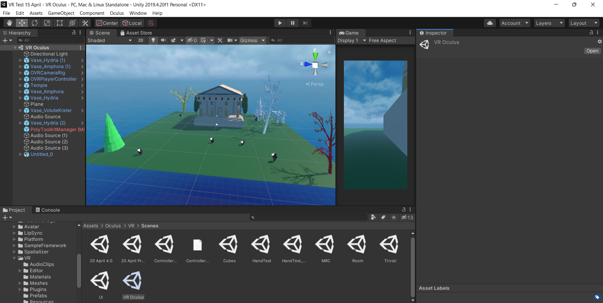{ width=80% }

#### Initial development

I wrote down the problem statement: when I move my head in the Oculus
Quest headset, the scene moves as well.

#### Reflection and refinement

To solve this problem, I looked at the elements in the VR demo scene
'ControllerModels' and compared it to my custom-built project. I
realised that I had an extra 'OVRCameraRig', which I did not need, as
the 'OVRPlayerController' already has a child OVRCameraRig included.
I tested the problem by removing the 'OVRCameraRig' from the hierarchy
and building the scene.

#### Finalisation

It works, and I can successfully walk around with head tracking and
locomotion; the 3D sounds work well, the VE is realistic with the Greek
skybox filled with snow-covered hills and blue skies mottled with
clouds.

#### Testing, review and conclusions

Problem statement: I edited the scene for testing to have the temple at a realistic scale
size; it is best to have the plane at 2 x 2 x 2. To take into my next
prototype, I moved the vases closer to the temple. A key learning from
this prototype was that the vases are too far apart; the plane's 3 x 3
x 3 scale is a bit large for a room-scale experience; so, I will reduce
it to 1 x 1 x 1 and test this smaller scale. However, 1 x 1 x 1 may
induce vertigo as the plane may be too small with the Greek Mountain
skybox for people with a fear of heights; the conclusion to take into
the next prototyping phase is to try out this problem.

### 21 April Prototyping Test 2

#### Initial development

I wrote down the problem Statement: the audio is not reactive.

#### Reflection and refinement

To fix the problem statement, I looped the audio source, made the audio
source setting: Spatial Blend 3D and Maximum Distance 50.

#### Finalisation

I moved the vases to match up with the name of each aria which I painted
in running cursive in Tilt Brush.

#### Testing, review and conclusions

A key learning was matching arias with visual models to create
audio-visual cohesion in the virtual environment.
The user will then walk towards each vase and the corresponding text to
hear each of the four arias/duets playback; the audio sources are mapped
to the following:

- Licht und Liebe (duet) is mapped to Vase_Amphora
- Mi amor la luna (aria) is mapped to Vase_Volutekrater
- Autumn Ayre (aria) is mapped to Vase_Amphora \[1\]
- Winter (duet) is mapped to Vase_Hydria

### 21 April Prototyping Test 3

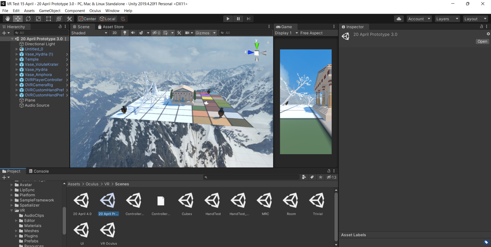{ width=80% }

#### Initial development

Test 3.1: Whilst in the experience it is enjoyable.

#### Reflection and refinement

I wrote down the problem statement: The Autumn Ayre aria name text model is clashing with the Vase_Amphora \[1\] model; fix this by moving the vase asset (done).
Add audio sources to each vase (done).

Problem statement 2: the *Tilt Brush* text is clashing with the vase asset
Fix the scale of Untitled_0 (my FBX model created in *Tilt Brush*) to make it bigger so that it does not clash with the vase asset (done).

#### Finalisation

Test 3.2: It looks excellent scale-wise while in the experience in the *Oculus
Quest* headset. 
Problem statement: the user begins the experience in the middle of a
tree model. I fixed this by moving the OVRPlayerController asset to the
middle of the vase area to begin the experience.

Test 3.3 Problem statement: The user starts in a position that is still too close
to the tree models. I moved the OVRPlayerController again. I added a
high-level audio source of cuckoo bird calls as ambient environment
foley for the experience. I also added the audio recording from one of
the opera rehearsals as a mock-up until the complete opera is recorded.

Test 3.4: Everything is working as it should; it is a realistic interactive VR
experience.

#### Testing, review and conclusions*

<!-- The key learning from these tests to take into the next prototype is: -->

Problem statement: there are no virtual hand controllers/gloves in
the experience; these shall be added in the next prototype, as having
virtual hands increases immersion in VR experiences (Interaction Design
Foundation, 2021).

### 17 May prototype

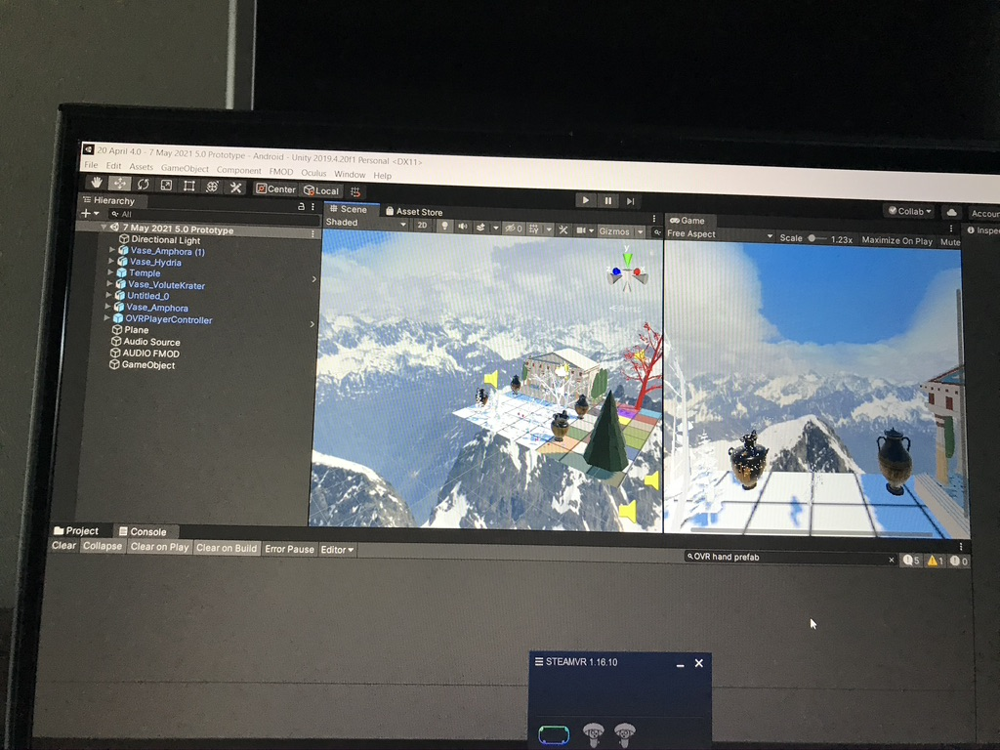{ width=80% }

#### Initial development

I implemented the virtual hands successfully after the following
troubleshooting.
Problem statement 1: I found that the virtual hands face the user's
body upwards over the physical forearm; thus, they face the wrong way.
To rectify this issue, I followed the steps outlined on the *Oculus*
developer's website *Hand Tracking in Unity Oculus Developers* to set up
hand tracking accurately.

#### Reflection and refinement

Problem statement 2: One feels as if they are hovering in space as I
changed the plane ratio to 1x1x1; thus, I went back into *Unity3D* and
moved the OVRPlayer game object to the centre of the plane to rectify
this issue.

#### Finalisation

Problem statement 3: I tried using a dial from the 'VR Buttons and
Levers' pack from the Unity asset store; however, this encountered
build errors due to compiler errors in the scripting. To rectify this
issue, I deleted the asset package and mapped the synth instrumental to
the trees.

Problem statement 4: I am not sure how to create an audio switch
container in *FMOD*. Despite googling resources, I will need to get
expert advice.

#### Testing, review and conclusions

A key learning from this prototype to take into the next was: problem
statement 5 the *FMOD* aria events may be clashing sonically with one
another whilst one is in the VR headset. The audio switch container
needs to be built alongside editing the distance attenuation in *FMOD*
to rectify this issue. The VR experience works successfully untethered
with the *Oculus Quest*, the tracking works well, and I can see the
virtual hands. The hands pass through the virtual objects. I need to add
physics colliders to the virtual hands or all the game objects for the
next prototype.

I also learnt to make sure that the *SteamVR* app is open and running on
the Alienware to track and play the experience on the Quest untethered
successfully.

## YouTubeVR Artemis

I painted in the 360-degree VR environment in *Tilt Brush* for VR for
the YouTubeVR version of *Artemis*. In *iteration #3* of the *YouTubeVR*
experience I painted the tree of life to represent Artemis' life (Figure 11). 

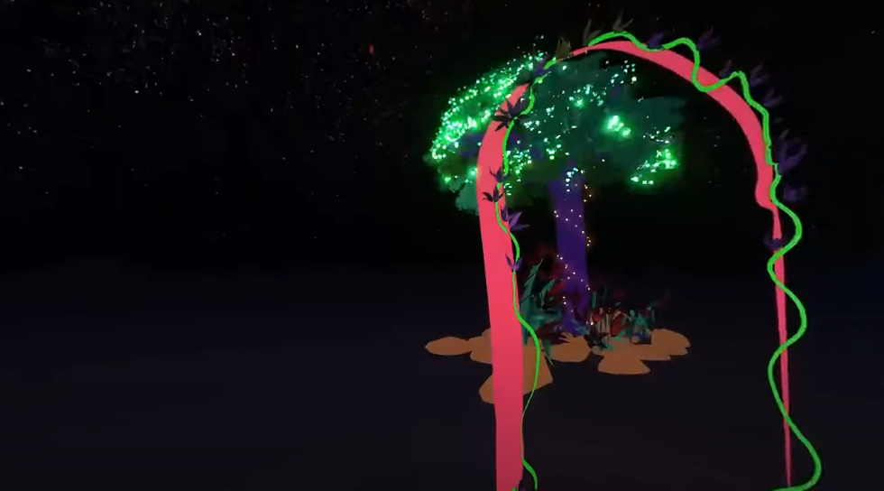{ width=50% }

Colour changes were added to the render in *Adobe Premiere Pro* to add
variation to the footage for each aria and duet. 
Blue tones were used for winter (Figure 12), I made the footage black and white to highlight the nightscape for the aria to the moon 'Mi amor la luna' (Figure 13), and 
I added orange tones to the footage in *Adobe* *Premiere Pro* for
autumn (Figure 14).

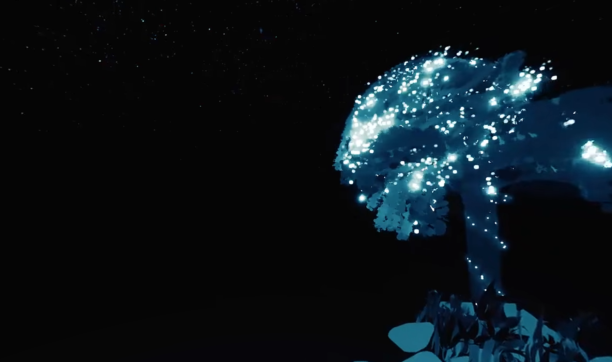{ width=50% }

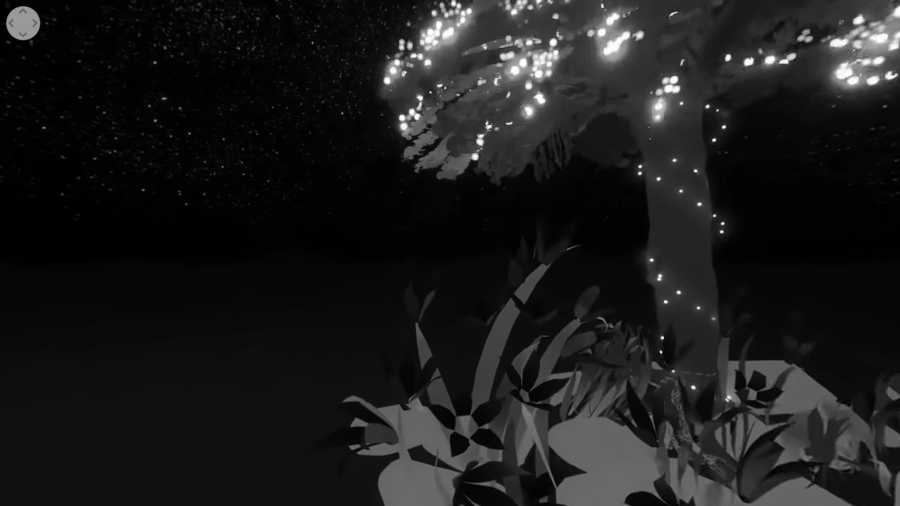{ width=50% }

{ width=50% }

## AR Artemis

This section looks at the AR performance work, working with a
mezzo-soprano operatic performer, an operatic tenor performer and
pianist. This chapter also looks at the process of creating AR content
by painting it in *Tilt Brush*, creating target images and QR codes and
scanning these with a smartphone during the live performance. A
performance video proof of concept is included in the Folio.

The AR 11 target images are painted in *Tilt Brush* and the QR codes are
printed out and stuck on music stands for the forthcoming opera
performance at BLOOM Festival. The target images overlay moving virtual
images which are triggered with the spectator's *EyeJack* mobile AR app.

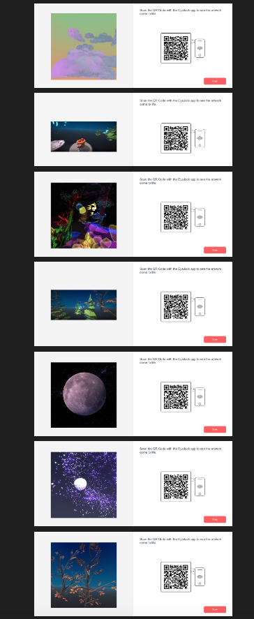{ width=50% }

## Video and audio examples

*Artemis* entails users being immersed in 360-degree environments, which
correspond to the theme of each aria or duet. By creating and making
assets and models of the visual experience in *Tilt Brush*, it gives
deeper meaning to the creative process by creating in VR for VR. I bring
in my perspective from the get-go by prototyping in VR in real-time;
this results in a cyclical artistic practice process in action formula
for creating new opera work. 

- Audio implementation in the Oculus version of Artemis [10.5281/zenodo.5748640](https://doi.org/10.5281/zenodo.5748640) 
- Artemis DOI: [10.5281/zenodo.5748649](https://zenodo.org/record/5748649)
- Artemis Mi amor la luna VR: DOI: [10.5281/zenodo.5748659](https://zenodo.org/record/5748659)

The AR and VR environments are interactive with the Oculus VR work
employing *Oculus Quest* hand tracking, the *YouTubeVR* version using
head-tracking, and the AR work utilising mobile interaction on the
*EyeJack* AR app. These different approaches cater for world building
(VR) versus place making (AR). Each version is interactive in a
different way, the *YouTubeVR* version is interactive through its
head-tracking which changes according to where the audience member looks
and audience members are encouraged to walk around the space to change
their perception of the space; the impact of this is a feeling of
immersivity, the effect is a total feeling of being there. The *Oculus*
version is more interactive than the *YouTubeVR* version, as it builds
upon it; head-tracking is used in both, however hand-tracking is only
used in the Oculus version. The impact is that the audience member
controls the playback order of different areas triggered by the
proximity of the hand-tracking to each of the four vases in the Oculus
version, the effect is a gamified musical experience for the audience
member. The AR version is interactive through the singer physically
guiding the audience member into the performance hall and prompting them
to scan a poster to download the AR app, the impact is a smooth
transition into the live AR experience, the impact is a feeling of
immersiveness in a hybrid augmented performance world, the effect is
being transported into a digital opera world.

# Discussion

People are increasingly making virtual operas, and opera's engagement
with technology has expanded to match this interest. In the Australian
context, the recommendations put forth in The National Opera Review
(2016) highlight the current opera climate, namely, subsection 7.4,
"Support the presentation of innovative works in collaboration with
festivals" (p. 54), and subsection 7.5, "Increase the use of digital
technology for innovation" (p. 55). This need for increased digital
innovation in opera led to the operatic industry expressing increased
interest in immersive projection, XR, and other digital media experience
creation. The digital staging of opera works is increasing, with *The
Ring Cycle* (Wagner, 1848) production by Opera Australia (forthcoming
2023), consisting of entirely virtual stages. Outside Australia, The
*Current, Rising* (Fernando, 2020) production at The Royal Opera house
shows a similar move towards "hyper-reality" (extremely realistic in
detail, including virtual reality technologies). Both productions use
virtual stages, which are considered easier to tour showing a trajectory
of change within opera to incorporate new technologies and create novel
mass-audience experiences.

My research compares the realisation of the same operatic text over
various mediums as a vehicle for comparing the impact of different XR
technologies on the process of opera creation from a composer's
perspective.
The implementation of these new workflows is documented through the
design of models such as Figure 5 and Figure 6; these are visualisations
of the same process outlined via two different lenses to explain how
self-experiential prototyping methodologies can guide composer-makers to
develop new works. Figures 5 and 6 model the workflows for designing
extended reality opera works from the perspective of a solo creator
responsible for all development stages; the maker goes directly from
brainstorming to making, a novel way of rapid prototyping.

Figure 5 highlights how a composer-maker creator tests out a prototyping
model, it is a systematic flow chart detailing the process for designing
and prototyping a new extended reality opera by implementing
self-experiential prototyping in a structured way. Step 1 entails the
maker brainstorming the overall aesthetic of their opera through
visualisation and note-taking. The maker moves directly from
brainstorming to making a rough and ready virtual environment in
*Unity3D*, moving between step 1 to step 2 by visualising their idea in
the brainstorming phase and then picking up the technology and making it
in step 2. After having built a rapid prototype, the maker moves from
this step (2) to step 3 by taking a piece of paper and writing down a
problem (step 3a) that the maker may experience which needs to be solo
tested. In the VR headset (step 3b), after solo testing, the maker will
find one problem that they have experienced while immersed in the rough
software prototype and write down problem statement 2 to document what
needs to be fixed (3c). The maker then moves between this step and the
next by going into *Unity3D* and fixing the error (problem statement) in
the backend of the software; after fixing this error to the best of the
maker's ability, the maker puts on the VR headset and undertakes solo
testing to see if the error was successfully fixed. The maker then moves
from this step to the final step of getting expert advice by 'building'
the *Unity3D* project and getting an expert to try out the VR experience
in a headset such as *Oculus Quest 1*. Figure 5 is refined into the
cyclical model of figure 6.

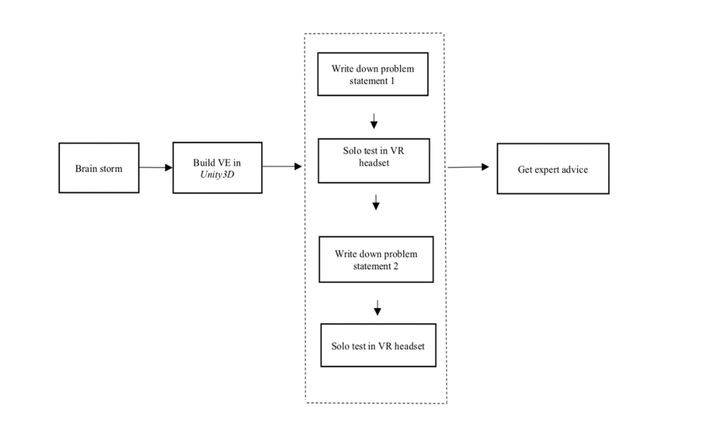{width="6.290785214348206in"
height="3.9051891951006126in"}

Figure 6 details my journey through each stage of self-experiential
prototyping. Smith and Dean's (2009) model states that academic
research and creative practice are interwoven aspects of knowledge
creation. Figure 6 emphasises the cyclical nature via arrows; this
relates to Smith and Dean's Iterative Cyclic web model, in which Smith
and Dean (2009) state that practice and research occur in a continuous
cycle. This is seen in Figure 6; whereby continuous knowledge creation
and testing encompasses the research projects' fundamental continuous
cyclic nature. I have applied this premise throughout my research
project, as the creative practice results in new models and processes
for future research by other makers and scholars.

Figure 6 begins with writing down a problem statement that you want to
solve, whereas Figure 5 begins with brainstorming. This highlights two
different approaches and lenses for beginning prototyping, I utilised
both in my project. Brainstorming is a broad-brush approach for
experience creation. Problem statements entail that the maker has
already begun testing and has found things to fix in the experience
software.

Figure 6 represents the cyclical processes of self-prototyping; step 1
entails the maker writing down a problem statement that they want to
solve. The maker then moves to make the software by building in
*Unity3D*, or if it is a second iteration of the cycle, refining the
virtual environment (VE) in *Unity3D.* The maker then moves from making
the software to trying out the experience by solo testing in the VR
headset (step 3). The maker then finds something that does not work well
while immersed in the experience. They take the headset off and write
down a second problem statement (step 4), then move between steps 4 and
5 by going back into the software and fixing the error identified in
problem statement 2. Then the maker moves to step 5 of solo testing.
Once the maker is happy with the fixed problem statements, they can
'build' the experience in *Unity3D* and ask an expert to watch the
experience on a VR headset. Then the maker requests the expert to give
constructive feedback on elements that need to be fixed. This
constructive feedback is then used as a new problem statement for the
next iteration of testing and leads to step 1.

{width="5.128836395450569in"
height="3.6268657042869643in"}

<!-- TODO: relabel this as a different number -->

# Conclusions

In conclusion, this research aimed to highlight the steps undertaken to utilise self-experiential iterative prototyping in the creation of three different virtual reality and augmented reality versions of a new opera, namely Artemis. The research outcomes included three versions and multiple iterations of the opera Artemis. The first version was created in Unity3D for viewing in the Oculus Quest virtual reality headset. The second version was created using Tilt Brush and Adobe Premiere Pro and deployed via YouTube VR. The third version was a live augmented reality experience developed to create a staging of the original opera.
Self-experiential prototyping was employed to create each opera version's compositions and immersive environments. The research outputs were new models for self-experiential prototyping and screenshots; video and audio works were included as the creative output. The techniques used in the development of the spatial sound in Artemis implemented with FMOD and Unity3D were discussed from the point of view of a composer-designer. The key takeaway was that the use of autoethnography, problem statements, and discussion of effective extended reality creation techniques and implementation resulted in the creation of a rich new body of work. 
The symbiotic relationship between VR development and music creation and implementation was explored. Different lenses were used as a means to explain the various hats that the composer-designer wore. This research was a cyclical artistic practice process in action formula for creating new extended reality music works. 
The study explained the iterative steps employed and how new technologies were utilised. Comparisons of the interactivity of the three different versions of Artemis were included in this research project.


# References

```{=latex}
\begin{hangparas}{1.5em}{1}
```

Laurel, B. (2013). *Computers as theatre*. Addison-Wesley.

Peters, E., Heijligers, B., Kievith, J., Razafindrakoto, X., Van
Oosterhout, R., Santos, C., Mayer, I., Louwerse, Max. (2016), "Design
for collaboration in mixed reality: technical challenges and solutions",
*In 8th International Conference on Games and Virtual Worlds for Serious
Applications (VS-GAMES)*, 1-7.

Schell, J. (2020). *The Art of Game Design: A book of lenses*. CRC
press.

Smith, H., & Dean, R. T. (2009). Introduction: practice-led research,
research-led practice-towards the iterative cyclic web. *Practice-led
research, research-led practice in the creative arts*, 1-38.

Spillers, F. (2017, October). Soundspace: toward accessible spatial
navigation and collaboration for blind users. In *Proceedings of the 5th
Symposium on Spatial User Interaction* (pp. 158-158). Retrieved from:
<https://doi.org/10.1145/3131277.3134921>

*The National Opera Review.* (2016). Retrieved October 2, 2021, from
<https://www.arts.gov.au/have-your-say/national-opera-review>.

Google Tilt Brush \[Computer software\]. (2022). Retrieved from
<https://store.steampowered.com/app/327140/Tilt_Brush/>

Unity Technologies. (2020). Retrieved from <https://unity.com/>

Unity3D \[Computer software\]. (2022). Retrieved from <https://unity3d.com/get-unity/download>

Xenakis, I. (1992). *Formalized music: thought and mathematics in
composition* (No. 6). Pendragon Press.

```{=latex}
\end{hangparas}
```
